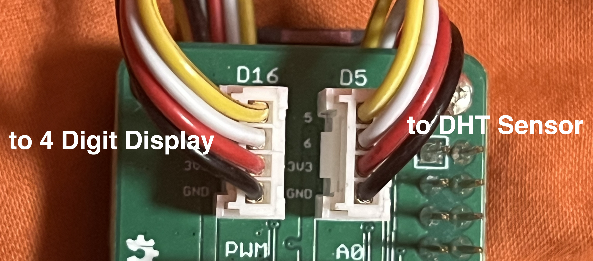

# raspberry-mqtt-test-kit
Example for using a Raspberry Pi Zero W with sensors to collect and send data via MQTT.

---

## Hardware
* Raspberry Pi Zero W
* Grove Base Hat
* Grove Temperature & Humidity Sensor
* Grove 4-Digit Display

---

## Software
* Raspberry Pi OS Lite (32-bit)
* Python 3.9.2

---

## Wiring
* Grove Temperature & Humidity Sensor: D5
* Grove 4-Digit Display: D16

As shown in the following image:

